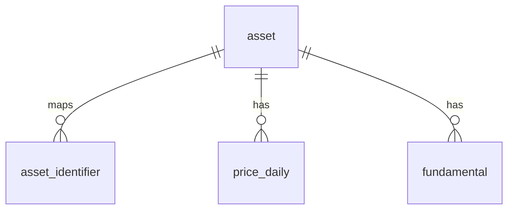

# TeamAlpha silver 스키마 (최소)

silver(PostgreSQL/RDS)는 bronze(S3)를 정규화해 적재한다. `asset_id`를 중심으로 가격·재무를 연결한다.
현재 소스는 KRX·DART지만, **`asset_identifier`와 `source` 컬럼으로 소스 추가에 열려 있다.**

**테이블 4.** (구 설계의 `shares_outstanding`은 `price_daily`에 흡수, `dart_fetch_status`·`index_membership`·`fundamental.raw`·뷰는 제거 — 뷰는 필요해지면 추가.)

## 1. asset — 종목 마스터 (소스 독립)

| 컬럼 | 타입 | 설명 |
|---|---|---|
| `asset_id` | `BIGINT` PK | 내부 공용 ID |
| `name` | `TEXT` | 종목명 |
| `asset_type` | `TEXT` | `stock` \| `index` |
| `exchange` | `TEXT` | 예: `KRX` (해외소스 대비) |
| `currency` | `TEXT` | 예: `KRW` |

## 2. asset_identifier — 소스별 코드 매핑 (확장점)

| 컬럼 | 타입 | 설명 |
|---|---|---|
| `asset_id` | `BIGINT` | → `asset` |
| `source` | `TEXT` | `KRX` \| `DART` \| (향후 `YAHOO`·`SEC`…) |
| `identifier` | `TEXT` | 해당 소스 코드. KRX=`005930`, DART=`00126380` |

- PK `(asset_id, source, identifier)` · lookup idx `(source, identifier)`

## 3. price_daily — 일봉 (주식 + 지수 공용)

| 컬럼 | 타입 | 설명 |
|---|---|---|
| `asset_id` | `BIGINT` | → `asset` |
| `source` | `TEXT` | 가격 출처 (`KRX` …) |
| `trade_date` | `DATE` | 거래일 |
| `open`·`high`·`low`·`close` | `NUMERIC(18,4)` | OHLC |
| `adj_close` | `NUMERIC(18,4)` | 수정종가 (아래 주의) |
| `volume` | `BIGINT` | 거래량 |
| `trading_value` | `NUMERIC(20,2)` | 거래대금 |
| `shares` | `BIGINT` | 상장주식수 (index는 NULL) |
| `market_cap` | `NUMERIC(24,2)` | 시가총액. index는 구성종목 시총 합계 (NULL 아님) |
| `market` | `TEXT` | 날짜별 시장 구분. `KOSPI` \| `KOSDAQ` \| `KONEX` (index는 NULL) |

- PK `(asset_id, source, trade_date)`
- **지수**는 `asset_type='index'`로 여기 저장 — `adj_close=close`, `shares`는 NULL. `market_cap`은 구성종목 시총 합계가 들어간다.
- **`market`은 날짜별 속성**이다. 종목은 KONEX→KOSDAQ, KOSDAQ→KOSPI처럼 시장을 옮길 수 있으므로 `asset`에 하나만 저장하지 않는다. `price_daily.market`을 기준으로 `WHERE market IN ('KOSPI', 'KOSDAQ')`처럼 필터링하면 시점 정확한 유니버스를 만들 수 있다.
- **`adj_close` 산출**: bronze는 **raw 체결가(무수정)**. 수정종가는 두 종류로 나뉜다.
  - **가격 수정(분할·무상·유상증자)** — **추가 소스 불필요.** KRX 등락률·전일대비가 조정기준으로 계산되므로 역산 가능: 일별 `조정전일종가 = close − 전일대비`(marcap `Changes` / krxapi `CMPPREVDD_PRC`), `일일계수 = 이전 close / 조정전일종가`(평일≈1, 이벤트일=조정비율) → 뒤에서부터 누적곱 → `adj_close`. (검증: 삼성 2018 50:1 분할계수 50.0 정확 재현.)
  - **총수익 수정(+배당)** — **배당 소스 필요**(배당금·배당락일; KRX 배당정보 or DART). bronze엔 없음. → 현재 `adj_close`는 **가격 수정**까지만. 배당 반영은 소스 추가 후.

## 4. fundamental — 재무 (long, DART)

| 컬럼 | 타입 | 설명 |
|---|---|---|
| `asset_id` | `BIGINT` | → `asset` |
| `source` | `TEXT` | `DART` … |
| `period_end` | `DATE` | 회계기간 종료일 |
| `fiscal_period` | `TEXT` | `FY`·`Q1`·`Q2`·`Q3`·`Q4` |
| `fs_type` | `TEXT` | `CFS`(연결) \| `OFS`(별도) |
| `filing_id` | `TEXT` | 접수번호(`rcept_no`) |
| `filed` | `DATE` | 접수일 |
| `available_date` | `DATE` | PIT 사용가능일 (아래 규칙) |
| `metric` | `TEXT` | 표준지표. `revenue`·`net_income`·`total_equity`… |
| `value` | `NUMERIC(20,2)` | 값 |

- PK `(asset_id, source, period_end, fiscal_period, fs_type, metric)` · PIT idx `(asset_id, metric, available_date)`

**`available_date` 규칙(DART)**: 접수일 있으면 `filed+1일`; 없으면 법정기한+1일(FY=`period_end+90일`, 분기/반기=`period_end+45일`, 주말이면 다음 월요일 보정 후 +1일).

## bronze → silver 매핑 (참고)

| silver | ← bronze |
|---|---|
| `price_daily` (stock) | `stock/marcap/`(백필) · `stock/krxapi/`(일별) — 소스 경계 안 겹침 |
| `price_daily` (index) | `index/krxapi/` 중 벤치마크(코스피200·코스닥150) |
| `fundamental` | `financials/dart/` — reprt `11011→FY`·`11013→Q1`·`11012→Q2`·`11014→Q3` |
| `asset`·`asset_identifier` | KRX 코드 = 각 시세 응답, DART corp_code = bronze `financials/dart/corpCode.xml` |
